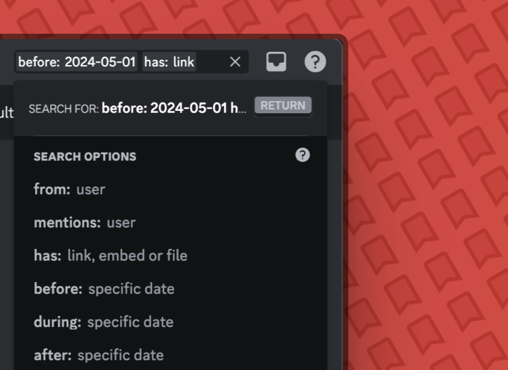

## Bookmark Embed Breakdown
The bookmark contains useful information such as:
- The message authors username, user ID and avatar
- The server's name, server ID and server icon
- The time you made the bookmark
- The buttons you can use to manage the bookmark. See more in [features](/features/)

## Use Native search
Discord's native search has powerful filters to help you find the exact bookmark you had saved.
Combine multiple search filters to get what you're looking for.

## Search with Tags (COMING SOON)
Changing the [Colour of a Bookmark](/features/colour-change.mdx) also adds "tags" such as xxxxxxxx.
These tags are based on the bookmark colour and in combination with Discord's Native search, you essentially have Bookmark categories which you can access from the search bar!

## Pin Messages
Important and useful bookmarks can be pinned in DMs so that they can be referred back to easily among other bookmarks
<Info>Right Click on a message --> Pin Message</Info>
<video
    controls
    autoPlay
    muted
    loop
    playsinline
    className="w-full aspect-video"
    src="https://cdn.daksh.cc/pin-bookmark-v1.mp4"
></video>